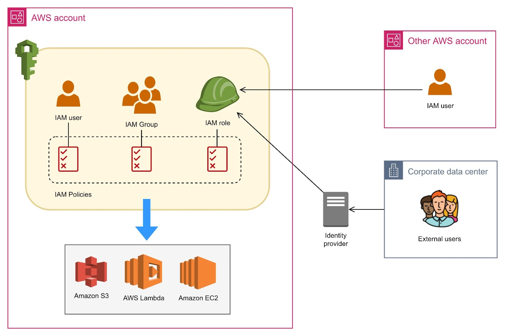
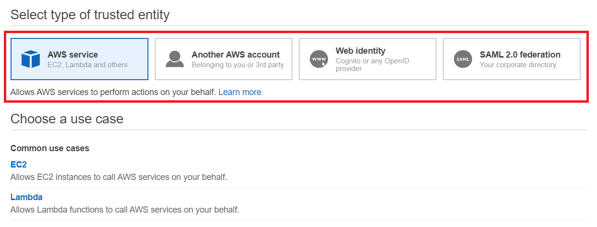
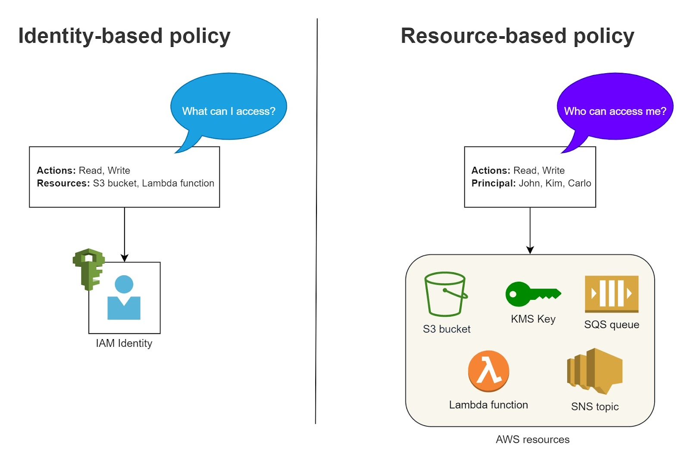
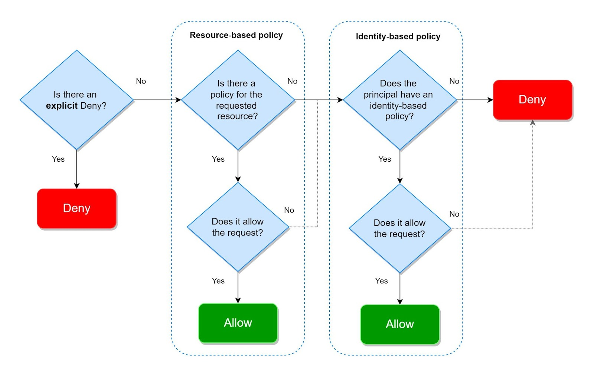
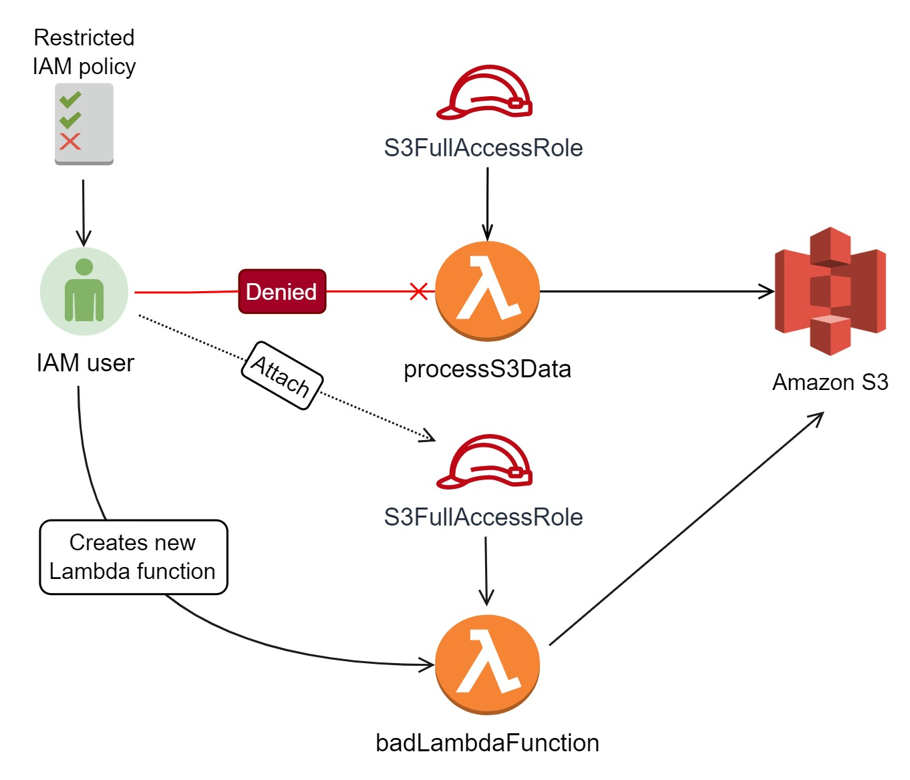

# AWS Identity Access Management (IAM)

IAM is the primary tool for controlling and managing access to an AWS account. It sits at the core of AWS
security; everything you do with AWS, whether it's creating a Lambda function, uploading a file to an S3 bucket,
or something mundane as viewing EC2 instances on the Console, is governed by IAM. It allows you to specify
who, which AWS resources, as well as what actions they can and cannot do. These are also known as
authentication and authorization.

## IAM Identities
IAM identities handle the authentication aspect of your AWS account. It pertains to any user, application, or
group that belongs to your organization.



An IAM identity can be an IAM User , IAM role , or IAM Group .

An **IAM User** represents the user or application who interacts with AWS services. Take note that an IAM user is different from the root user. Although full admin permissions can be given to an IAM user, there are certain actions that only a root user can carry out, such as deleting an AWS account. IAM users are given long-term credentials for accessing AWS services. These credentials can be in the form of a username and password (for console access) or an access key and secret key (for programmatic access). The former is primarily used when logging into the AWS Console, whereas the latter is used when interacting with AWS Services via CLI/API commands.

An **IAM role** isn’t intended to be associated with a unique user, rather, it is meant to be assumed by certain AWS Services or a group of external users with common business roles. Unlike IAM users, roles use time-limited security credentials for accessing AWS. When creating a role, you choose a trusted entity. The trusted entity determines who is authorized to assume the IAM role.

An IAM role can be assumed by AWS Services to perform actions on your behalf, an IAM user within your account or from an external one, and users federated by identity providers that AWS trusts. Examples of these identity providers are Microsoft Active Directory, Facebook, Google, Amazon, or any IdP that is compatible with OpenID Connect (OIDC) and SAML 2.0.



**IAM Group** is simply a collection of IAM users. The policies attached to an IAM Group are inherited by the IAM users under it. It’s possible to assign an IAM user to multiple groups, but groups cannot be nested (a group within a group). IAM group offers an easy way of managing users in your account. For example, if you have a team of developers that needs access to AWS Lambda, instead of attaching the necessary permission for them individually, you can put the developers together in an IAM Group called ‘Developers’ and associate the Lambda permissions to that group. If a new member joins the team, simply add him/her to the ‘Developers’ IAM group.

## IAM Policy
An IAM identity cannot perform AWS actions without an IAM Policy attached to it unless the resource being accessed allows the IAM Identity to do so. An IAM Policy is what authorizes an IAM user or role to control and access your AWS resources. There are three types of IAM Policies to choose from:

* AWS Managed Policies - these are built-in policies that have been constructed to conform to common use cases and job roles. For example, let’s say you’re working as a system administrator, and you have to give your new database administrator the necessary permissions to do his/her job. Rather than figuring out the right permissions, you may simply use the DatabaseAdministrator managed policy, which grants complete access to AWS services necessary to set up and configure AWS database
services. AWS Managed Policies cannot be deleted or modified. 
* Customer-managed Policy - this refers to the policies that you manually create in your account.
* Inline Policy - a policy that is embedded in an IAM Identity. Unlike AWS Managed Policies and Customer-managed Policies, an inline policy does not have its own ARN; thus, it can’t be referenced by other IAM identities. It is scoped to a specific IAM user or role. 

References:

- https://docs.aws.amazon.com/IAM/latest/UserGuide/id_users.html
- https://docs.aws.amazon.com/IAM/latest/UserGuide/access_policies.html
- https://docs.aws.amazon.com/IAM/latest/UserGuide/id_groups.html


## IAM Policy Structure
An IAM Policy is expressed as a JSON document. It is made up of two components: policy-wide information and one or more statements. The policy-wide information is an optional element that is placed on top of the document. It’s usually just a Version element pertaining to the AWS policy language version being used. This element usually has a static value of 2012-10-17 , referring to the release date of the current AWS policy access language.

The Statement block is where you add the permissions you need for accessing various AWS services. A policy can have single or multiple statements where each statement is enclosed within a bracket.

The following is an example of an IAM Policy.

```json
{
    "Version": "2012-10-17" ,
    "Statement": [
    	{
    	    "Sid": "AllowFullEC2AccessFromMyNetwork" ,
        	"Effect": "Allow" ,
	        "Action": [
	        	"ec2:DescribeInstance*" 
	        ],
    	    "Resource": "*" ,
        	"Condition": {
	        	"IpAddress": {
	        		"aws:SourceIp": "180.0.111.0/24" 
	            }
    	    }
	   }
	]
}
```

An individual statement has the following elements:

* **`Statement ID (Sid)`** - this is just a label that you give to a statement. It’s helpful for quickly identifying  what a statement is for rather than reviewing what’s in the Action , Effect , or Resource . This element is optional; however, it might be useful when modifying or debugging policies with multiple statements.
* **`Effect`** - explicitly dictates whether the policy allows or denies access to a given resource. It only accepts an Allow or a Deny .
* **`Action`** - this element contains the list of actions that the policy allows or denies. You can use the (*) wildcard to grant access to all or a subset of AWS operations. In the example above, the ec2:DescribeInstance* refers to all actions that start with the string “DescribeInstance”. So this can be referring to DescribeInstanceAttribute , DescribeInstances , DescribeInstancesStatus , and so on.
* **`Resource`** - the list of AWS resources to which the Action element is applied. The example policy above uses a (*) wildcard alone to match all characters. This implies that Action is applicable to all resources. You can be more restrictive to the resources that you want to work with by specifying their Amazon Resource Names (ARN).
* **`Condition`** - an optional element that you can use to apply logic to your policy when it’s in effect. For instance, the sample policy above only allows requests originating from the 180.0.111.0/24 network. Some conditions that you should be aware of are:
    * `StringEquals` - Exact string matching and case-sensitive
    * `StringNotEquals` - Negated matching
    * `StringLike` - Exact matching but ignoring case
    * `StringNotLike` - Negated matching
    * `Bool` - Lets you construct Condition elements that restrict access based on true or false values.
    * `IpAddress` - Matching specified IP address or range.
    * `NotIpAddress` - All IP addresses except the specified IP address or range
    * `ArnEquals`, `ArnLike`
    * `ArnNotEquals`, `ArnNotLike`
    * Use a `Null` condition operator to check if a condition key is present at the time of authorization.
    * You can add IfExists to the end of any condition operator name (except the `Null` condition)—for example, `StringLikeIfExists`.

References:

- https://docs.aws.amazon.com/AWSEC2/latest/UserGuide/iam-policy-structure.html
- https://aws.amazon.com/blogs/security/back-to-school-understanding-the-iam-policy-grammar/

## Identity-based Policy vs. Resource-based Policy
There are six types of IAM Policy: *Identity-based policies*, *Resource-based policies*, *IAM permissions boundaries*, *Service Control Policies*, *Session policies*, and *Access Control Lists (ACLs)*. For the purpose of the exam, we will focus only on Identity-based and Resource-based policies. The difference between them is pretty simple. The Identity-based policies are policies you attach to an IAM Identity, such as IAM user or IAM role. On the other hand, resource-based policies are attached to AWS resources, such as an S3 bucket (bucket policy), KMS key (key policy), or a Lambda function. Take note that not all AWS resources support resource-based policies.



An **Identity-based policy** defines the resources and actions that an IAM user or role has access to. Since the policy is attached to the IAM user or role, the Principal element doesn't need to be explicitly specified. In other words, the IAM user or role that the policy is attached to is implicitly considered the principal. 

A **Resource-based policy** , on the other hand, must include both the Principal and Resource elements. The Principal element specifies which IAM identities are allowed to access the resource, while the Resource element specifies which resources users are allowed to perform actions on. For example, a bucket policy is a type of resource-based policy that is attached to an Amazon S3 bucket. The policy specifies the actions that are allowed on the bucket and the IAM users or roles that are allowed to perform those actions.

The following S3 bucket policy is an example of how the Resource element is used to grant resource-level permissions. You can see that the tdojo S3 bucket contains two folders, john-folder and dave-folder, to which IAM users John and Dave have read access, respectively.

```json
{
    "Version": "2012-10-17",
    "Statement": [
        {
            "Effect": "Allow",
            "Principal": {"AWS": "arn:aws:iam::123456789000:user/john"},
            "Action": [
                "s3:GetObject",
                "s3:GetObjectVersion"
            ],
            "Resource": [
                "arn:aws:s3:::tdojo/john-folder"
            ]
        },
        {
            "Effect": "Allow",
            "Principal": {"AWS": "arn:aws:iam::123456789000:user/dave"},
            "Action": [
                "s3:GetObject",
                "s3:GetObjectVersion"
            ],
            "Resource": [
                "arn:aws:s3:::tdojo/dave-folder"
            ]
        }
    ]
}
```

An important aspect of IAM that you need to understand is how different policies are evaluated. Before determining whether your request is allowed or not, AWS evaluates all explicit DENY statements first on all policies that are involved. If the requester is specified in a DENY statement in either of the policies, IAM denies the request. Second, between the resource-based and identity-based policies, resource-based policies are evaluated first. For example, an IAM user with an empty IAM policy will still be able to access an S3 bucket as long as its bucket policy allows the IAM user to perform actions on the bucket.

Here's a stripped-down version of the AWS flow chart on policy evaluation. Only resource-based and IAM-based policies are included for simplicity.



**References:**

- https://docs.aws.amazon.com/IAM/latest/UserGuide/access_policies_identity-vs-resource.html

- https://docs.aws.amazon.com/IAM/latest/UserGuide/reference_policies_evaluation-logic.html


## Cross-account access
The policy evaluation logic discussed in the previous section is for Intra-account access which involves users and AWS resources interacting with each other within the same account. The evaluation of policies is quite different when it comes to cross-account access. 

Cross-account access refers to access between two or more separate AWS accounts. This could be an EC2 instance in one AWS account accessing an S3 bucket in a different AWS account or a user in one account assuming a role in another account to access resources in that account.

### Cross-account for IAM users
Imagine an IAM User named ‘Tucker’ in Account A who needs to download documents from the `private/documents` folder of an S3 bucket in Account B.

To grant this permission, the following actions must be configured:

1. In Account B, the S3 bucket owner creates an S3 bucket policy that specifies Tucker is allowed to download the documents. The policy should be attached to the `private`  S3 bucket in Account B.
   
    *Example S3 bucket policy in Account B:*

```json
{
    "Version": "2012-10-17",
    "Statement": [
        {
            "Effect": "Allow",
            "Principal": {"AWS": "arn:aws:iam::<Account A ID>:user/Tucker"},
            "Action": "s3:GetObject",
            "Resource": "arn:aws:s3:::private/documents/*"
        }
    ]
}
```

2. In Account A, Tucker must have an IAM policy that grants permissions to access the S3 bucket in Account B. The policy allows Tucker to access the S3 bucket without assuming an IAM role.
   
    *Example IAM policy for Tucker in Account A:*
```json
{
    "Version": "2012-10-17",
    "Statement": [
        {
            "Sid": "DownloadDocuments",
            "Effect": "Allow",
            "Action": ["Action": "s3:GetObject" ],
            "Resource": "arn:aws:s3:::private/documents/*"
        }
    ]
}
```

After setting up the required permissions in both accounts, Tucker can now use AWS SDK or CLI to access the
S3 bucket in Account B and download the documents.

#### How is access evaluated?

If Tucker makes a request to the bucket in Account B, AWS performs two evaluations to determine whether the request is allowed or denied, one in the trusting account (AccountB) and one in the trusted account (AccountA). In Account A, AWS checks the identity-based policy of Tucker and any policies that can limit actions that he’s requesting. In AccountB, AWS evaluates the bucket policy and any policies that can limit the action being requested. The request is only allowed if both evaluations result in a decision of "Allow". If any policy evaluation returns a decision of "Deny", the access request is denied.

### Cross-account for IAM roles

Alternatively, an administrator in Account B can create an IAM role for Tucker to assume. This method provides a more scalable and flexible solution, as the administrator can easily modify or revoke access to the S3 bucket as needed. For instance, if there are other IAM users in Account A that need similar access to the bucket, the administrator can simply grant permission for them to assume the IAM role rather than modifying the S3 bucket policy for each user. This approach reduces administrative overhead in granting access to the bucket. 

Here are the steps for how you might grant any IAM users in Account A to assume an IAM role in Account B.

1. In Account B, the IAM administrator creates an IAM role with a policy that grants access to the S3 bucket.
   
    *Example S3 bucket policy in Account B:*

```json
{
  "Version": "2012-10-17",
  "Statement": [
    {
      "Sid": "DownloadDocuments",
      "Effect": "Allow",
      "Action": ["s3:GetObject"],
      "Resource": "arn:aws:s3:::private/documents/*"
    }
  ]
}
```

2. The IAM administrator must also attach a trust policy to the IAM role, specifying which AWS accounts and entities are allowed to assume the role. In this case, the trust policy must include Account A as a trusted account.
   
    *Example trust policy in Account B (Note that the “**root**” refers to any Principals in Account A, excluding the root user):*

```json
{
  "Version": "2012-10-17",
  "Statement": [
    {
      "Effect": "Allow",
      "Principal": {"AWS": "arn:aws:iam::AccountA:root"},
      "Action": "sts:AssumeRole"
    }
  ]
}
```

3. The policy for an IAM user in Account A must allow the sts:AssumeRole action on the ARN of the IAM role in Account B.
   
    *Example IAM policy for an IAM user in Account A:*

```json
{
  "Version": "2012-10-17",
  "Statement": [
    {
      "Effect": "Allow",
      "Action": "sts:AssumeRole",
      "Resource": "arn:aws:iam::<Account B ID>:role/RoleName"
    }
  ]
}
```

#### How is access evaluated?

Once the trust policy is evaluated in Account B, AWS verifies whether the IAM user (in Account A) assuming the IAM role is authorized to do so. Once the IAM user assumes the role, AWS checks if the IAM role has sufficient permissions to access the requested resource in the bucket. After that, the S3 bucket policy is evaluated and access will be granted only if all policy evaluations result in a decision of "Allow". 

**References:**

- https://docs.aws.amazon.com/IAM/latest/UserGuide/reference_policies_evaluation-logic-cross-account.html
- https://aws.amazon.com/blogs/security/how-to-use-trust-policies-with-iam-roles/

## IAM:PassRole Permission
PassRole is a special type of IAM permission that permits a user to associate IAM roles to an AWS resource. This is a simple yet powerful permission that warrants due scrutiny when constructing IAM Policies. You can, for example, use the PassRole permission to prohibit certain IAM users from passing roles that have greater permissions than the user is allowed to have. Let me paint a scenario for you to explain this.

Say your company has a Lambda function that processes data stored on Amazon S3. An execution role with full S3 access is attached to the Lambda function. The Lambda function runs per schedule and only admins are authorized to make code changes to it. Even though you don’t have access to the Lambda function, you can bypass the permissions given to you if the following policy is attached to your IAM user.

```json
{
  "Version": "2012-10-17",
  "Statement": [
    {
      "Effect": "Allow",
      "Action": "iam:PassRole",
      "Resource": "*"
    }
  ]
}
```

The preceding IAM policy allows you to pass any IAM roles that exist on your company’s AWS account. This creates a security hole that can be exploited to elevate your access. Given you have enough permissions to create Lambda functions, all you have to do is launch a fresh Lambda function and attach the execution role that has full S3 access. Doing so, even if your IAM user lacks S3 permissions, you’d still be able to access Amazon S3 using the Lambda function.



For better security, be more granular when it comes to providing access. For example, list the specific IAM roles that a user can pass rather than just using a wildcard, like what’s shown below:

```json
{
  "Version": "2012-10-17",
  "Statement": [
    {
      "Effect": "Allow",
      "Action": "iam:PassRole",
      "Resource": [
        "arn:aws:iam::123456789123:role/td-cloudwatch-agent-role",
        "arn:aws:iam::123456789123:role/td-s3-role"
      ]
    }
  ]
}
```

**References:**

- https://docs.aws.amazon.com/IAM/latest/UserGuide/id_roles_use_passrole.html
- https://docs.aws.amazon.com/IAM/latest/UserGuide/reference_policies_examples_iam-passrole-service.html

### Additional Notes

In AWS, Role-Based Access Control (RBAC) is implemented using AWS Identity and Access Management (IAM). RBAC in AWS allows you to define permissions based on roles that align with specific job functions within your organization. Each role has an associated set of permissions specified by IAM policies. These roles can be allocated to anyone, including groups or services, granting them the access they need to carry out their responsibilities. As an example, you can define roles like Admin, Developer, or ReadOnly User, each of which has certain rights that limit what they can do and on which AWS resources. This method simplifies the management of access controls by grouping permissions based on roles rather than managing permissions for each individual user . 

**References:**

- https://docs.aws.amazon.com/prescriptive-guidance/latest/saas-multitenant-api-access-authorization/access-control-types.html