# AWS Lambda

AWS Lambda lets you run codes without managing servers. You don't need to worry about tasks such as scaling, patching, and other management operations that are typically done on EC2 instances or on-premises servers. You can allot the maximum memory available for a Lambda function, as well as the function's execution duration, before timing out. The memory, which scales proportionally to the CPU power, can range from 128 MB to 10,240 MB in 1-MB increments. The default timeout is three seconds, with a maximum value of 900 seconds (15 minutes).

A Lambda function can be invoked in different ways. You can invoke a function directly on the AWS Lambda console, via the `Invoke` API/CLI command, or through a [Function URL](#Lambda function URL) . You can set up certain AWS Services to invoke a Lambda function as well. For example, you can create a Lambda function that responds to Amazon S3 events (e.g. *processing files as they are uploaded to an S3 bucket*) or set up an Amazon EventBridge rule that triggers a Lambda function every week to perform batch processing. Lambda functions are also commonly used as a backend for APIs that do not require constant load, such as handling login requests or on-the-fly image processing.

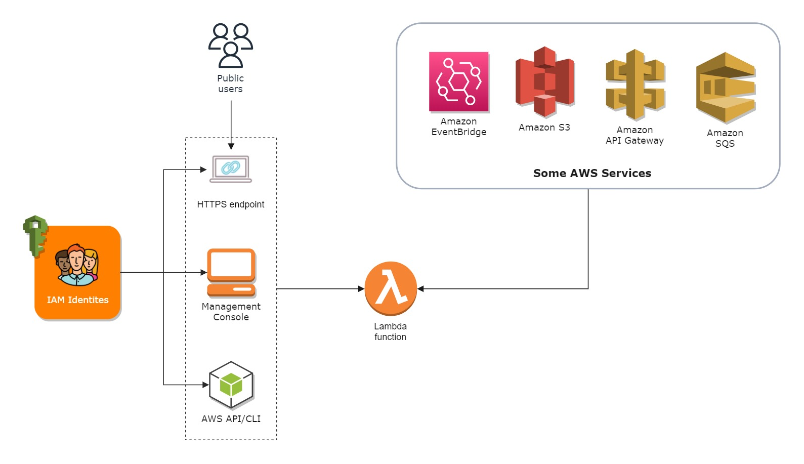

## Synchronous vs. Asynchronous Invocations

There are two invocation types in AWS Lambda.

### Synchronous

The first type is called **Synchronous** invocation, which is the default. Synchronous invocation is pretty straightforward. When a function is invoked synchronously, AWS Lambda waits until the function is done processing, then returns the result. Let’s see how this works through the following example:

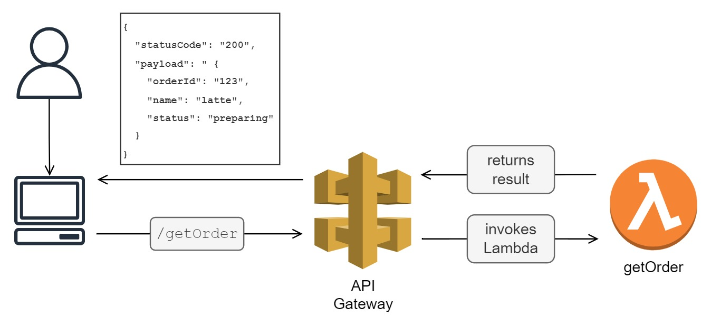

The image above illustrates a Lambda function-backed API that is managed by API Gateway. When API Gateway receives a GET request from the /getOrder resource, it invokes the getOrder function. The function receives an event containing the payload, processes it, and then returns the result. 

Considerations when using synchronous invocation:

* If you’re planning to integrate AWS Lambda with API Gateway, take note that A**PI Gateway’s integration timeout is 29 seconds**. If a function takes longer than that to complete, the connection will time out, and the request will fail. Hence, use synchronous invocations for applications that don’t take too long to complete (e.g., authorizing requests, and interacting with databases). 
* Synchronously-invoked functions **can accept a payload of up to 6 MB**.
* You might need to implement a retry logic in your code to handle intermittent errors.

To call a Lambda function synchronously via API/CLI, set RequestResponse as the value for the `invocation-type` parameter when calling the Invoke command, as shown below:

```shell
aws lambda invoke \
	--function-name testFunction \
	--invocation-type RequestResponse \
	--cli-binary-format raw-in-base64-out \
	--payload '{ "input" : "input_value" }' response.json
```

Alternatively, you may just omit the `invocation-type` parameter as AWS Lambda invokes functions synchronously by default.

Services that invoke Lambda functions synchronously (*services irrelevant to the exam are excluded*):
* Amazon API Gateway
* Application Load Balancer
* Amazon Cognito
* Amazon Data Firehose
* Amazon CloudFront (Lambda@Edge)

### Asynchronous 

An Asynchronous invocation is typically used when a client does not need to wait for immediate results from a function. Some examples of these are long-latency processes that run in the background, such as batch operations, video encoding, and order processing.

When a function is invoked asynchronously, AWS Lambda stores the event in an internal queue that it manages. Let’s understand asynchronous invocation through the example below:

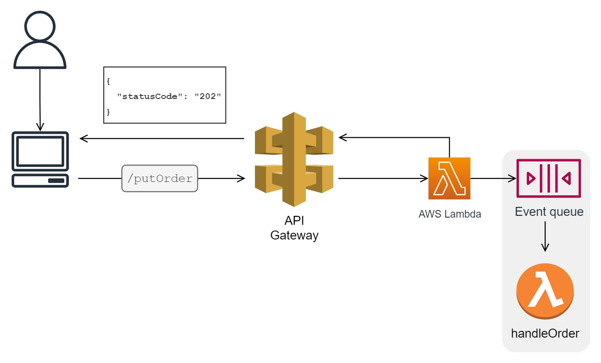

A PUT request is made to the `/putOrder` resource. Like the previous example, the request goes through API Gateway, which produces an event. This time, instead of API Gateway directly invoking the function, AWS Lambda queues the event. If the event is successfully queued, AWS Lambda returns an empty payload with `HTTP 202 status code`. The `202 status code` is just a confirmation that the event is queued; it’s not indicative of a successful invocation. The client will not be required to wait for the Lambda function to complete. So, to improve user experience, you can create a worker that tracks order completion and sends notifications once the order is successfully processed.

To call a Lambda function asynchronously via the Invoke command, simply set Event as the value for the invocation-type parameter, as shown below:

```shell
aws lambda invoke \
	--function-name testFunction \
	--invocation-type Event \
	--cli-binary-format raw-in-base64-out \
	--payload '{ "input" : "input_value" }' response.json
```

Considerations when using asynchronous invocation:

* Asynchronously-invoked functions can only accept a payload of up to 256 KB.
* The Lambda service implements a retry logic for asynchronously-invoked functions
* Good for applications that run in the background (batch processing, video encoding)

Services that invoke Lambda functions asynchronously (*services irrelevant to the exam are excluded*):

* Amazon API Gateway (by specifying Event in the `X-Amz-Invocation-Type` request header of a non-proxy integration API)
* Amazon S3
* Amazon CloudWatch Logs
* Amazon EventBridge
* AWS CodeCommit
* AWS CloudFormation
* AWS Config

### Handling failed asynchronous invocations
AWS Lambda has a built-in retry mechanism for asynchronous invocations. If the function returns an error,
Lambda will attempt to retry the request two more times, with a longer wait interval between each attempt.

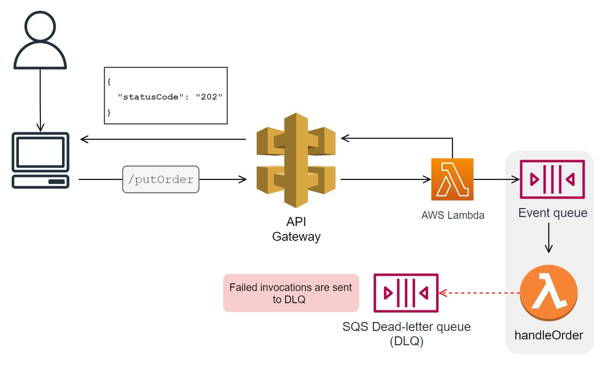

The request is discarded after AWS Lambda has exhausted all remaining retries. To avoid losing events, you may redirect failed request attempts to an SQS dead-letter queue so that you can debug the error later and have another function retry it.

**References:**

- https://docs.aws.amazon.com/lambda/latest/dg/lambda-invocation.html
- https://aws.amazon.com/blogs/architecture/understanding-the-different-ways-to-invoke-lambda-functions/

## Event source mappings
Stream or queue-based resources such as DynamoDB streams, SQS queues, and Kinesis Data Streams streams do not invoke Lambda functions directly. Typically, we read records from these resources using pollers. A poller is an application that periodically checks a queue, pulls records from it (sometimes in batches), and sends them to a downstream service that will process them.

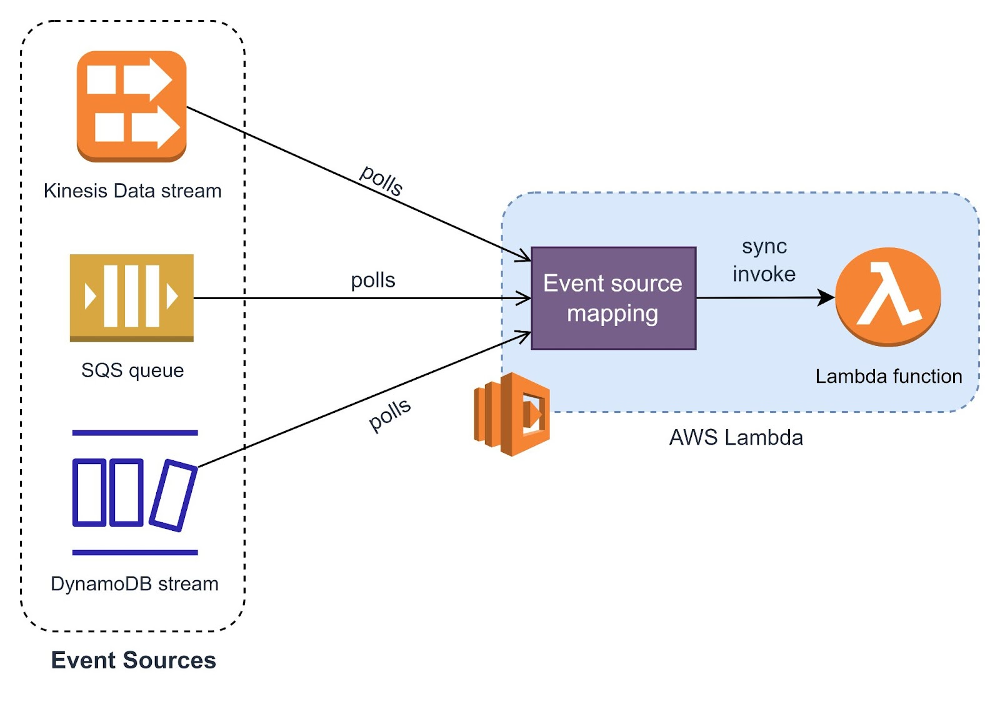

An event source mapping is a sort of polling agent that Lambda manages. Event source mappings take away the overhead of writing pollers from scratch to retrieve messages from queues/streams. This allows you to focus on building the domain logic of your application.

Event source mapping invokes a function synchronously if one of the following conditions is met:

1. **The batch size is reached** - The minimum batch size can be set to 1, but the default and maximum batch sizes vary on the AWS service that invokes your function.
2. **The maximum batching window is reached** - The batching window is the amount of time Lambda waits to gather and batch records. The default batch window for Amazon Kinesis, Amazon DynamoDB, and Amazon SQS is 0. This means that a Lambda function will receive batches as quickly as possible. You can tweak the value of the batch window based on the nature of your application.
3. **The total payload is 6 MB** - Because event source mappings invoke functions synchronously, the total payload (event data) that a function can receive is also limited to 6MB (the limit for synchronous invocations). This means that if the maximum record size in a queue is 100KB, then the maximum batch size you can set is 60.

## Event filtering

A Lambda function is billed based on how long it runs. How often functions are invoked plays a major factor as well. This is why Lambda is great for scheduled jobs, short-duration tasks, and event-based processes. But does this mean you shouldn’t use them for high-volume traffic applications? There is no definitive answer as it will always be on a case-to-case basis. It usually depends on factors such as the requirements of your application and the cost trade-off you’re willing to make. Regardless, if you ever find yourself wanting to use Lambda in a high-activity application like stream processing, it’s good to know that there are methods available
to offset the cost of running functions.

Batching is one cost optimization technique for Lambda functions. By increasing the batch size value, you can reduce the frequency at which your function runs. In addition, you can also filter events that are only needed by your function, thus lowering the cost even further.

Consider the following scenario:

You’re tasked to develop a function that reacts to voltage drops or temperature changes that might indicate faulty components in a site. Multiple sensors send readings to a Kinesis Data Stream stream, which must be consumed and processed by a Lambda function.

Your first instinct might be to implement filtering logic within the Lambda function, as shown below:

```python
def lambda_handler (event, context):
    temperature = event["temperature"]
    voltage = event["voltage"]
    if temperature > 100 or voltage < 5 :
        #do something
    else :
        #do nothing
```

The code may be valid, but it is deemed inefficient due to cost as t**he Lambda function will be invoked unnecessarily with every sensor data transmission, even if it doesn't require processing**. Supposed sensor data is sent every second. This results in 60 invocations per minute at a batch size of 1 and batching window of 0. This can lead to a waste of time and resources if none of the readings contain the desired voltage and temperature values.

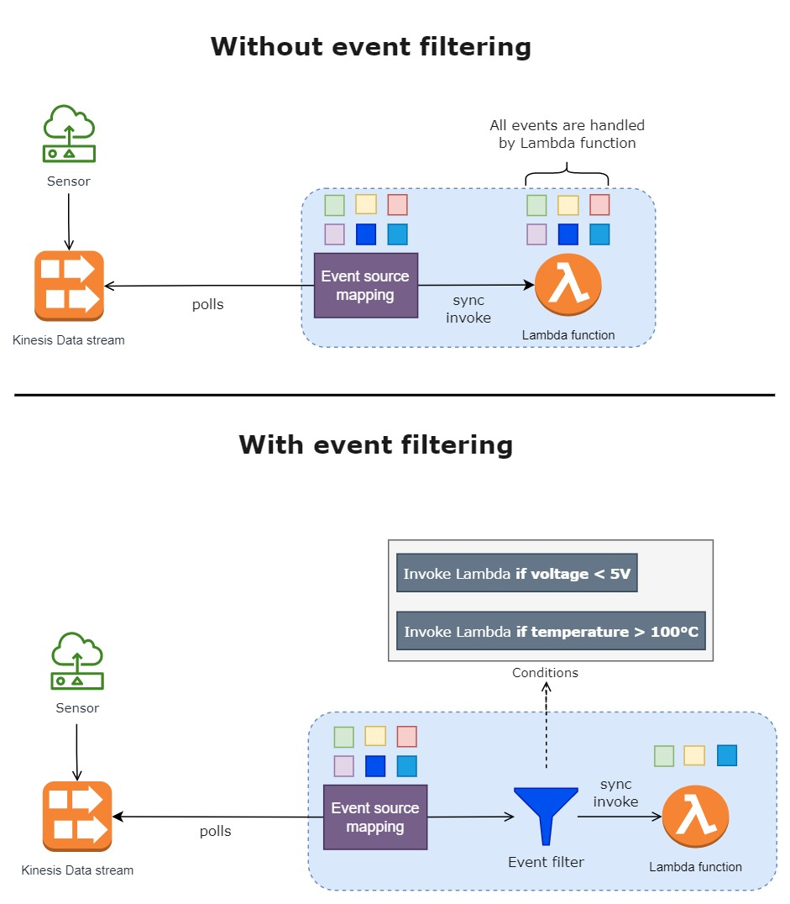

To address this, rather than doing conditional checks for each event at the function level, you should filter the events before they are passed down to your function. Going back to the scenario, since you’re only interested in specific values of voltage and temperature, you can specify a filter pattern using the `filter-criteria` parameter of the `CreateEventSourceMapping` command.

```shell
aws lambda create-event-source-mapping \
--function-name process-sensor-readings \
--batch-size 10 \
--starting-position LATEST \
--event-source-arn arn:aws:kinesis:us-east-1:123456789123:stream/sensors \
--filter-criteria '{"Filters": [{"Pattern": "{\"temperature\": [{\"numeric\": [\">\", 100]}]}"},{\"voltage\": [{\"numeric\": [\"<\", 5]}]}]}'
```

A single event source can have up to five unique filters. If an event matches any of the filters, Lambda routes it to your function. Otherwise, the event is discarded. The exam won’t expect you to be an expert in event filtering, but you should be familiar with it at a high level. You may also refer to this for the full list of filter syntax.

**References:**

- https://docs.aws.amazon.com/lambda/latest/dg/invocation-eventfiltering.html
- https://aws.amazon.com/blogs/compute/filtering-event-sources-for-aws-lambda-functions/

## Execution Environment Lifecycle

Lambda functions undergo three phases when invoked. These are:
1. `INIT Phase`
    * Occurs when a Lambda function is invoked for the **first time after being deployed** or after **a long period of inactivity**.
    * Consists of two stages: *environment creation* and *code initialization*.
    * **Environment creation** - AWS Lambda creates an instance of a function in an isolated and secure environment inside a micro virtual machine . This 'execution environment' is where the Lambda function code actually runs. Under the hood, AWS Lambda uses a virtualization technology called Firecracker to provision environments. Firecracker makes use of lightweight micro virtual machines, allowing AWS Lambda to create environments quickly, even with a high volume of requests, without sacrificing security or performance. The amount of CPU and memory allocated to the execution environment is determined by the memory settings that you've configured for your Lambda function.
    * **Initialization** - after setting up the environment, Lambda pulls your code from Amazon S3 (Lambda function codes are securely stored in Amazon S3) and runs the initialization code. Initialization code is any code written outside of the handler function. These could be your imported dependencies, global variables, objects, etc. 
    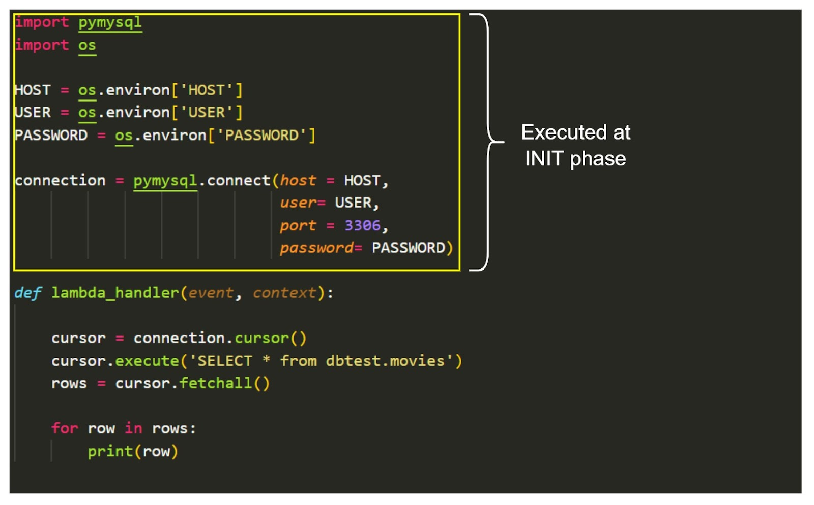
    * The time it takes for the INIT phase to complete adds latency to your function's total execution  time. This ‘delay’ caused by the bootstrapping of execution environments is also known as `cold start` . AWS does not charge for the cold start that happens during the INIT phase; however, initialization times must not exceed 10 seconds

2. `INVOKE Phase` 
    * This is the stage at which the handler function is run. Once the handler function is done processing, AWS Lambda keeps its execution environment warm (on standby) for a period of time. This allows the function to accept subsequent invocation requests without having to create a new execution environment. As a result, the total execution time of your function is shortened because Lambda does not have to repeat everything that was done during the INIT phase.
    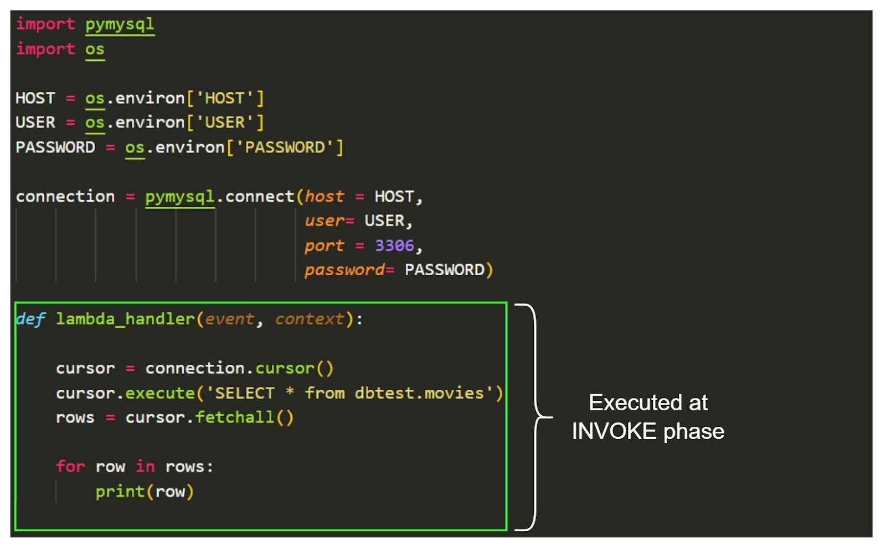

3. `SHUTDOWN Phase`
    * When an execution environment stops getting invocation requests for quite some time, AWS Lambda terminates it. There is no documented time limit, but based on experience, execution environments are normally kept warm for 5-15 minutes, though this can vary.

The image below illustrates the lifecycle of a Lambda function.

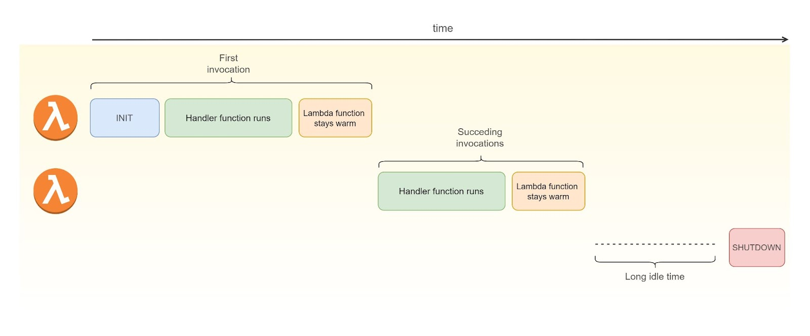

**Reference:**

- https://docs.aws.amazon.com/lambda/latest/dg/runtimes-context.html

## Reducing Cold Starts

The more libraries/packages you include, the longer your function’s cold start. That said, you have to be aware and careful in choosing which dependencies to import. There are two approaches you can take to deal with cold starts. The first one is to only load what you need. This method is completely free. You simply have to be
more specific and concise when it comes to the resources that you include in your function. In doing so, fewer data will be initialized.

The second is by using Provisioned Concurrency. Provisioned Concurrency is a Lambda feature that allows you to allot pre-warmed environments for your Lambda functions. This will provide your application with constant latency, allowing it to reply to queries in the low double-digit milliseconds. Take note that Provisioned concurrency is different from Reserved concurrency. However, the concept of shared concurrency is the same. The concurrency limit tied to a Region is divided between Shared concurrency and Provisioned concurrency.

References:

* https://aws.amazon.com/blogs/compute/operating-lambda-performance-optimization-part-1/
* https://aws.amazon.com/blogs/compute/operating-lambda-performance-optimization-part-2/

## Execution Environment Reuse

Re-using your existing execution environment is all about reusing the config settings, dependencies, global variables, or even database connections that were already initialized during the INIT phase. To reuse, simply place all global variables, database connections, or SDK clients that you have outside of your handler function. 

Below is an example of a Lambda function code where an initialized resource is not taken advantage of. You can see that the database client is written inside the function handler.

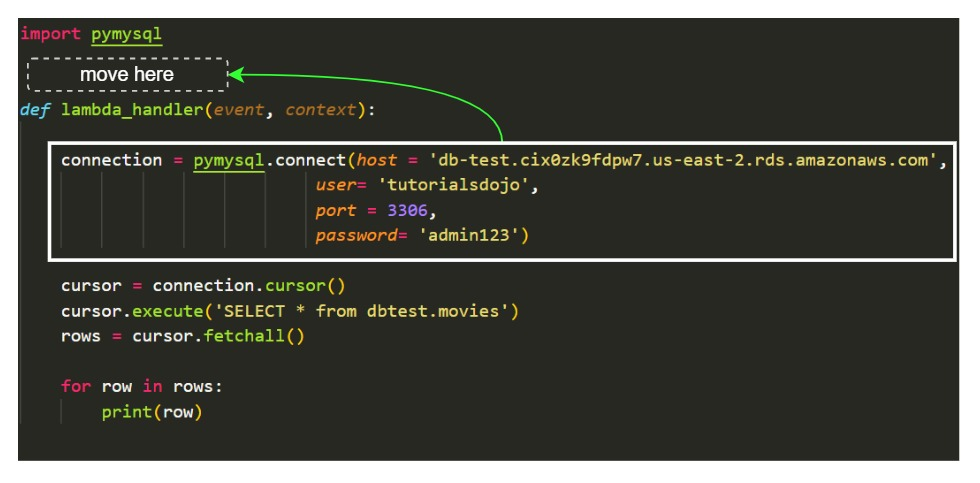

If this is the case, your function will open a new database connection every time it is invoked, which is costly compute-wise and adds latency to the execution time. To eliminate this extra time, move the connection object outside the handler function so that it is only initialized once. This way, subsequent requests would be able to reconnect to the existing connection. You are charged for the time it takes your function to run, so a shorter execution duration means you’d pay less.

In addition, keep in mind that each execution environment offers a **512 MB - 10 GB of temporary storage** that can be accessed at the /tmp directory. This temporary storage is quite useful for caching any data that your function needs to process at every invocation. Imagine a Lambda function that downloads an S3 file into memory each time it is called. This is inefficient if the file is rarely updated and read by multiple users. Also, because of resource constraints or code performance issues, it is not always feasible to load large data into memory at once. To solve this, instead of directly consuming data from memory, store the data in the `/tmp` directory and process it in chunks. As a result, the next time the same file is requested, your Lambda function will simply retrieve it from its local storage rather than the S3 bucket.

**References:**

- https://docs.aws.amazon.com/lambda/latest/operatorguide/execution-environment.html
- https://docs.aws.amazon.com/lambda/latest/dg/best-practices.html

## Environment variables
An environment variable is a `key-value` pair that you can store and retrieve in your Lambda function. Environment variables are tied to a function and its specific version, which means no other functions can access it except for the function it is associated with. Environment variables are shared between execution environments that belong to the same function.

A common scenario where environment variables are useful is when you want to configure different parameters for an application without touching the code. Say you have a Lambda function that needs to be tested against a development API before using the production API. In this case, instead of hardcoding the API endpoints and keys within the function code, you create two environment variables and pull them using the methods available to the programming language that you’re using. That way, you’d be able to change parameters tied to different environments without editing and redeploying your code. Just update the values of your environment variables. Making manual edits in the actual code isn’t a big deal, but it can be cumbersome and can lead to errors, so this environment variable is a nifty feature to help you write clean and reusable serverless functions.

There are 4 things that you must consider when creating an environment variable:

1. Keys must start with a letter and are at least two characters.
2. Keys must consist of only letters, numbers, and the underscore character (\_).
3. There are environment variables that AWS Lambda uses during the INIT phase. These are called reserved environment variables . A key for a reserved environment variable cannot be used in your function configuration. For example, if you’re using an AWS SDK, you might define a variable called ‘AWS_REGION’. This will end up to an error since AWS_REGION is a reserved variable.
4. The total size of all environment variables must not exceed 4 KB.

**References:**

- https://docs.aws.amazon.com/lambda/latest/dg/configuration-envvars.html
- https://aws.amazon.com/premiumsupport/knowledge-center/lambda-common-environment-variables/
- https://aws.amazon.com/premiumsupport/knowledge-center/lambda-environment-variables-iam-access/

## Lambda function URL
You can optionally configure an HTTPS endpoint (a.k.a `function URL`) that maps to a specific **alias or version** of your Lambda function. Like any other URLs, function URLs can be accessed via web browsers or through HTTP clients like `urllib3`, `request` (in Python), or `axios` (in Node.Js).

When you enable function URL, you get to choose between two auth types: `AWS_IAM` and `NONE`. `AWS_IAM`, as the name implies, is only applicable to IAM identities; the requester must be an IAM user or IAM role. AWS Lambda will make a decision on whether to grant access to a function based on the IAM user's or role's permissions.

Function URLs with a `NONE` auth type, on the other hand, let a Lambda function be invoked publicly. At first glance, it sounds risky, and you may wonder why anyone would ever do this. When you use the NONE auth type, AWS Lambda is no longer responsible for authenticating requests. This gives you the freedom to implement your own authentication logic. You may, for example, allow access to your Lambda function to only those who are logged in to your website. Aside from that, you may also configure a [CORS]() setting to specify the domain/s from which invocation requests must originate.

**References:**

- https://docs.aws.amazon.com/lambda/latest/dg/lambda-urls.html
- https://aws.amazon.com/blogs/aws/announcing-aws-lambda-function-urls-built-in-https-endpoints-for-single-function-microservices/

## Deploying Codes with External Dependencies
As developers, whether you’re coding at work or building your own project, it is highly likely that you import at least one module, framework, or library. Libraries save time and make you more productive. You wouldn't want to reinvent the wheel and build functions from scratch unless you’re facing a unique case that has not been solved before. If you’re going to be building applications in AWS Lambda, it’s essential that you know how to include dependencies in your Lambda functions. 

There are dependencies that come prebuilt to a specific runtime and there are also external ones. The former can be used out of the box. The latter is usually downloaded from a public repository and installed on your computer. Often, this is done with the help of a package manager (e.g., npm for NodeJs , pip for Python ). AWS Lambda does not have a terminal where you can run pip/npm commands to install external dependencies on an execution environment. And it wouldn’t make sense to have one since Lambda functions are run on temporary environments.

To deploy codes with external dependencies to AWS Lambda, do the following steps:

1. Install all external dependencies locally on your application’s folder.
2. Create a deployment package by zipping up the project folder. You can achieve this using the native Windows zip utility or zip command in Linux.
3. Upload the deployment package to AWS Lambda. You can send the file directly to the AWS Lambda Console or store it first to Amazon S3 and deploy it from there.

The first step is always the most important. See to it that you install dependencies required by your application locally on your folder and make sure that you correctly reference them in your code. If not done correctly, you might encounter an `Unable to import module error` , which could mean two things: it’s either you’ve placed the dependencies on a location that Lambda couldn’t find, or it is simply non-existent. 

**References:**

- https://docs.aws.amazon.com/lambda/latest/dg/python-package.html
- https://aws.amazon.com/premiumsupport/knowledge-center/build-python-lambda-deployment-package/

## Lambda Layers

Bundling external dependencies along with the function code gets the job done, but it has some drawbacks. First, deploying multiple Lambda functions that have the same dependencies is inefficient and would just bloat the total size of your functions. Second, updating dependencies takes time and effort. Updating each function that shares similar dependencies can slow down the development process. Lambda Layers solves these problems.

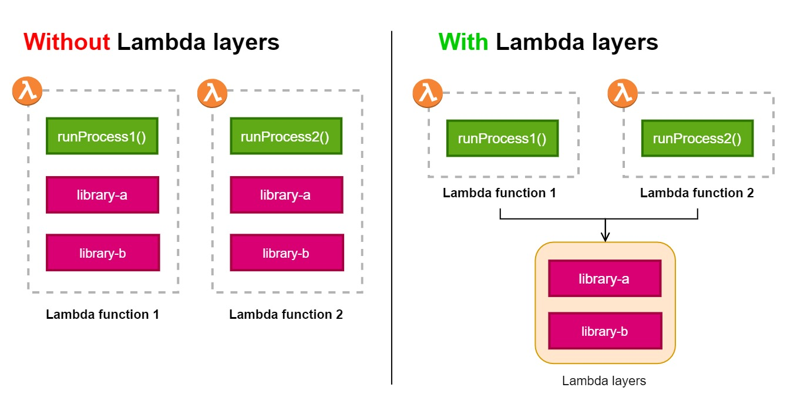

Lambda Layers lets you store any additional code (e.g., external dependencies, custom runtimes) separately from your deployment package. Just like a deployment package, external dependencies must be in zip format before being uploaded to AWS Lambda.

Lambda layers can be shared among Lambda functions, making it convenient and easy to update dependencies. In addition, the deployment process becomes more modularized, and your deployment package becomes significantly smaller.

**References:**

- https://docs.aws.amazon.com/serverlessrepo/latest/devguide/sharing-lambda-layers.html
- https://aws.amazon.com/blogs/aws/new-for-aws-lambda-use-any-programming-language-and-share-common-components

##  Concurrency and Throttling

AWS Lambda is inherently scalable, but like many other things, there’s a limit to how much it can scale to. It is important that you become aware of this, especially when you’re building a high-throughput application using Lambda functions.

Concurrency is the number of Lambda function executions that can run simultaneously for a period of time. By default, AWS imposes a **limit of 1,000 unreserved concurrent executions** across all Lambda functions for every region per account. But you can overcome this limit and further increase concurrent executions up to hundreds of thousands by contacting AWS Support.

You can strategically distribute concurrencies across your functions, but the **unreserved count** should not go below **100**. This means that the default maximum value of allowable **reserved concurrent executions** is limited to **900**. The reserved concurrent executions allocated to a function set the maximum number of concurrent instances for that function.

Example:

* **Lambda function A**
    - reads and uploads files to Amazon S3.
    - 150 concurrent executions are reserved for this function.
* **Lambda function B**
    - writes and updates items in a DynamoDB table
    - 250 concurrent executions are reserved for this function.
* **Lambda function C**
    - processes HTTP requests from API Gateway
    - unreserved concurrency.

Simply adding the concurrent executions of functions A and B gives us a total reserved concurrency of 400. That leaves us with 600 unreserved concurrency executions. So what happens when the demand for Lambda function A exceeds 150 concurrent executions? This is where throttling comes into play. When a function hits its maximum concurrency limit, AWS Lambda will reject incoming invocations and return a 429 status code throttling error. It is not possible for Lambda function A to borrow from the remaining unreserved concurrency pool.

When computing the Concurrency limits for a Lambda function, consider two things:

1. Execution time
2. Number of requests handled per second (requests per second)

Example:

* Lambda function
    - processes HTTP requests from API Gateway with unreserved concurrency
    - Expects an average execution time of 10 seconds
    - Expects 150 requests per second.

Multiplying the average execution time by the number of requests per second gives us 1,500 concurrency executions. This is beyond the default limit. If you bring this function to production, you’ll end up with a lot of failed requests due to throttling. One of the things you could try doing in this scenario is to optimize the Lambda code and hope to reduce the execution time. A sure alternative would be to increase the default limit by contacting AWS Support.

**References:**

- https://docs.aws.amazon.com/lambda/latest/dg/configuration-concurrency.html
- https://aws.amazon.com/blogs/compute/managing-aws-lambda-function-concurrency/

## Connecting a Lambda Function to a VPC
If you want your Lambda function to interact with resources (e.g., RDS database, EC2 instance) inside a private subnet, you won't be able to do so by default. The reason for this is that Lambda functions live in an isolated and secured VPC managed by AWS. This is why when you create a Lambda function, you don’t go through any networking configurations (VPC, subnet, ENIs), unlike when creating EC2 instances. You cannot establish a VPC peering connection between the VPC where Lambda functions are run and the VPC where your private resources are located because the former is not accessible to customers. The proper way is to configure your function to connect to a VPC.

To connect your Lambda function to a VPC, first, make sure that your function’s execution role has the required permissions to manage the creation and deletion of Elastic Network Interfaces (ENI). This is needed because AWS Lambda creates and deletes elastic network interfaces on subnets that you specify in your function’s VPC configuration. AWS uses an internal service called AWS Hyperplane, which serves as a NAT service, connecting Lambda functions to the ENIs in your VPC. Thankfully, there’s the `AWSLambdaVPCAccessExecutionRole` managed IAM policy, which contains the permissions needed for the job.

Next, specify the VPC where your private resources are located under the Lambda function’s network settings. When you create a VPC configuration, you get to choose the subnets where the ENIs are deployed and a security group that controls the traffic between your Lambda function and VPC. 

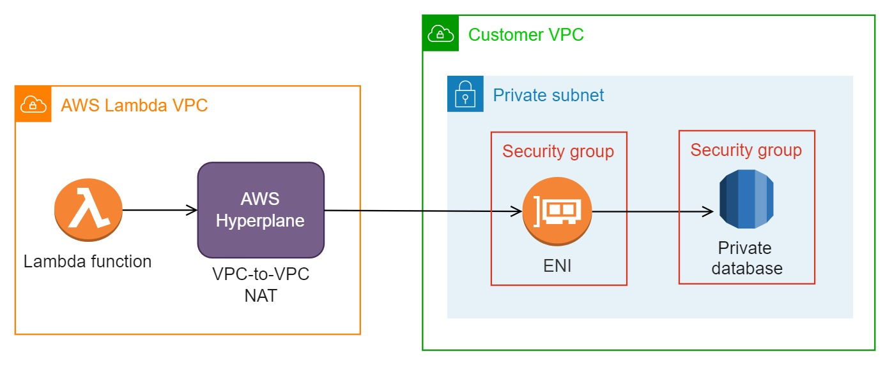

Once connected, your Lambda function will lose internet access. This happens due to the fact that AWS Lambda only assigns private IP addresses to ENIs that it creates. Even if your function is connected to a public subnet, your VPC's internet gateway will still be unable to route traffic between the internet and your function. To give your Lambda function internet access, create a NAT Gateway in the public subnet of your function's VPC and add an entry to the private subnet's route table. Set 0.0.0.0/0 as the destination and the NAT Gateway as the target.

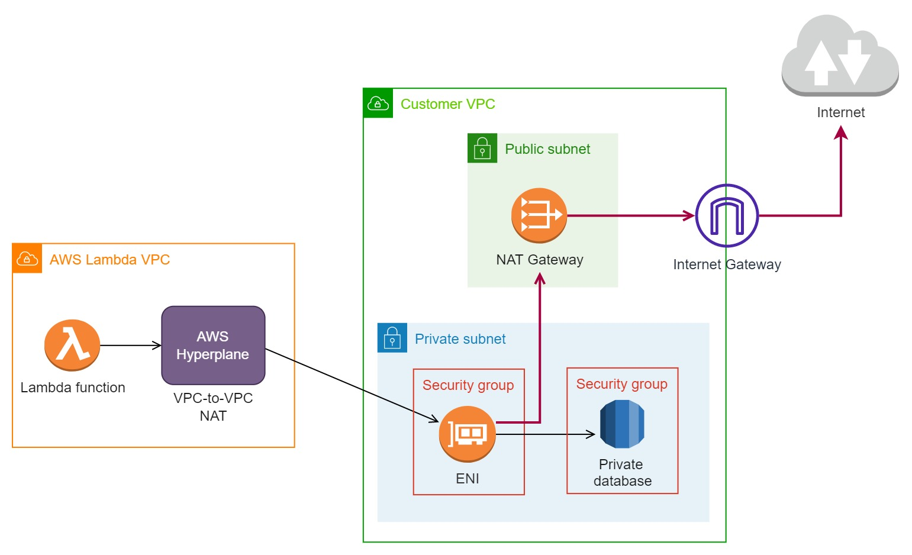

**References:**

- https://aws.amazon.com/premiumsupport/knowledge-center/internet-access-lambda-function
- https://docs.aws.amazon.com/lambda/latest/dg/configuration-vpc.html

## Versions and Aliases
Revisions are almost unavoidable when developing applications, whether you’re adding new features or fixing bugs. Instead of directly making changes to the stable version of your Lambda function, you can publish new versions of it where you can play around and experiment at will without affecting the stable version. 

A version is a snapshot of a Lambda function’s state at a given time. When you publish a new version, a :version-number suffix is appended to your function’s ARN, which indicates its version. An example is shown below:

```
arn:aws:lambda:us-east-2:123456789123:function:cool-function :1
```

AWS Lambda assigns version numbers monotonically. This means that if you delete a version and publish another one, the sequencing of numbers as you add versions will not reset; rather, it’ll just increment.

The unpublished version is also referred to as the `$LATEST` version. If you call a function without any suffix, AWS Lambda will implicitly invoke the `$LATEST`version. Take note that published versions are immutable; any modifications to the code or function configuration are not possible. If you want to make code or config updates, apply the changes to the `$LATEST` version and publish it as another version.

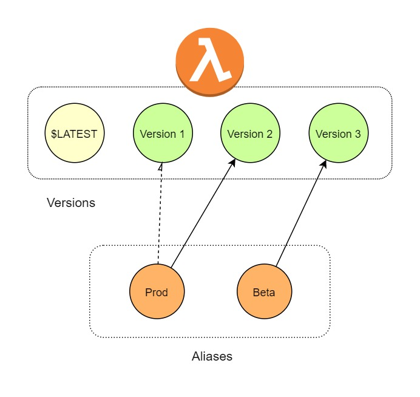

The problem with versions is that you have no control over what is appended to the function's ARN. It can be bothersome to have to update the function's ARN in your code or app parameters every time a new version is released. Wouldn't it be great if there’s a pointer that we can use to switch between versions? In this way, you can simply set and forget the ARN of the function. This is where Aliases come into play. You can think of an alias as a nickname that you give to a version number. 

To invoke a function with an alias, simply append a `:alias-name` suffix to your function’s ARN, just like the example below:

```
arn :aws:lambda:us-east-2:123456789123:function:cool-function : PROD
```

You can change the version that the alias is pointing to in the Lambda Console or via the UpdateAlias API.

**References:**

- https://docs.aws.amazon.com/lambda/latest/dg/configuration-aliases.html
- https://docs.aws.amazon.com/lambda/latest/dg/configuration-versions.html
