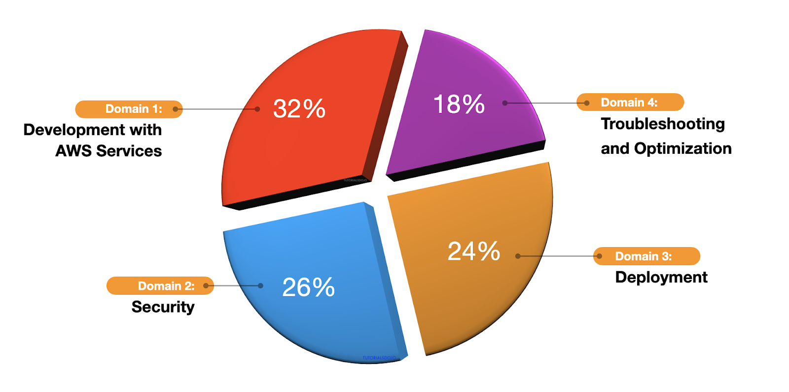

# Exam Overview

Amazon Web Services (AWS) began the Global Certification Program with the primary purpose of validating the technical skills and knowledge for building secure and reliable cloud-based applications using the AWS platform. By successfully passing the AWS exam, individuals can prove their AWS expertise to their current and future employers.

The AWS Certified Solutions Architect - Associate exam was the first AWS certification that was launched in 2013, followed by two other role-based certifications: Systems Operations (SysOps) Administrator and Developer Associate later that year. AWS is always releasing new development services and features on its cloud platform; thus, there is a continuous stream of updates on its exam content. Some changes are minor ones, while others are major updates that overhaul the entire certification test.

The very first version of the AWS Certified Developer - Associate exam (DVA-C00) and was released in [January 2014](https://aws.amazon.com/about-aws/whats-new/2014/01/13/new-certification-exams-available-for-developers-and-sysops-administrators/). Four years later, in June 2018, AWS released the updated version of this test with an exam code of [DVA-C01](https://aws.amazon.com/blogs/apn/check-out-the-updated-aws-certified-developer-associate-exam/). AWS unveiled the third iteration of this test with [DVA-C02 as its latest exam code](https://aws.amazon.com/blogs/training-and-certification/updated-aws-certified-developer-associate-registration-now-open/). You might notice that for every major exam update, the last digit of the exam code is incremented, so expect that the next one will be called DVA-C03 after several years. It’s quite important to know the relevant details of the AWS exam version to ensure that you are using up-to-date review materials

## Exam Details

The AWS Certified Developer - Associate examination is intended for individuals who perform a development role and have one or more years of hands-on experience developing and maintaining an AWS-based application.

|                       |                                         |
| --------------------- | --------------------------------------- |
| **Exam Code:**        | DVA-C02                                 |
| **No. of Questions:** | 65                                      |
| **Score Range:**      | 100/1000                                |
| **Cost:**             | 150 USD                                 |
| **Passing Score:**    | 720/1000                                |
| **Time Limit:**       | 2 hours 10 minutes (130 minutes)        |
| **Format:**           | Multiple choice/multiple answers        |
| **Delivery Method:**  | Testing center or online proctored exam |

## Exam Domains
The AWS Certified Developer - Associate exam has four (4) different domains, each with corresponding weight and topic coverage. The exam domains are Development with AWS Services (32%), Security (26%), Deployment (24%), and Troubleshooting and Optimization (18%)

1. **Domain 1: Development with AWS Services (32%)**
   1. Develop code for applications hosted on AWS
   2. Develop code for AWS Lambda
   3. Use data stores in application development
2. **Domain 2: Security (26%)**
   1. Implement authentication and/or authorization for applications and AWS services
   2. Implement encryption by using AWS services
   3. Manage sensitive data in application code.
3. **Domain 3: Deployment (24%)**
   1. Prepare application artifacts to be deployed to AWS.
   2. Test applications in development environments
   3. Automate deployment testing
   4. Deploy code by using AWS CI/CD services.
4. **Domain 4: Troubleshooting and Optimization (18%)**
   1. Assist in a root cause analysis
   2. Instrument code for observability.
   3. Optimize applications by using AWS services and features.

## Exam Scoring
You can get a score from 100 to 1,000 with a minimum passing score of **720** when you take the AWS Certified Developer Associate exam. AWS uses a scaled scoring model to associate scores across multiple exam types that may have different levels of difficulty. Your complete score report will be sent to you by email 1 - 5 business days after your exam. However, as soon as you finish your exam, you’ll immediately see a pass or fail notification on the testing screen.

For individuals who unfortunately do not pass their exams, you must wait 14 days before you are allowed to retake the exam. There is no hard limit on the number of attempts you can retake an exam. Once you pass, you’ll receive various benefits, such as a discount coupon which you can use for your next AWS exam.

Once you receive your score report via email, the result should also be saved in your AWS Certification account already. The score report contains a table of your performance on each domain and it will indicate whether you have met the level of competency required for these domains. Take note that you do not need to achieve competency in all domains for you to pass the exam. At the end of the report, there will be a score performance table that highlights your strengths and weaknesses, which will help you determine the areas you need to improve on.

## Exam Benefits
If you successfully pass any AWS exam, you will be eligible for the following benefits:

- **Exam Discount** - You’ll get a 50% discount voucher to apply for your recertification or any other exam you plan to pursue. To access your discount voucher code, go to the “Benefits” section of your AWS Certification Account, and apply the voucher when you register for your next exam.
- **AWS Certified Store** - All AWS certified professionals would be given access to exclusive AWS Certified merchandise. You can get your store access from the “Benefits” section of your AWS Certification Account.
- **Certification Digital Badges** - You can showcase your achievements to your colleagues and employers with digital badges on your email signatures, Linkedin profile, or on your social media accounts. You can also show your Digital Badge to gain exclusive access to Certification Lounges at AWS re-invent, regional Appreciation Receptions, and select AWS Summit events. To view your badges, Go to the “Digital Badges” section of your AWS Certification Account.
- **Eligibility to join AWS IQ** - With the AWS IQ program, you can monetize your AWS skills online by providing hands-on assistance to customers around the globe. AWS IQ will help you stay sharp and well-versed in various AWS technologies. You can work in the comforts of your home and decide when or where you want to work.

You can visit the official AWS Certification FAQ page to view the frequently asked questions about getting AWS Certified and other information about the AWS Certification: https://aws.amazon.com/certification/faqs/.
