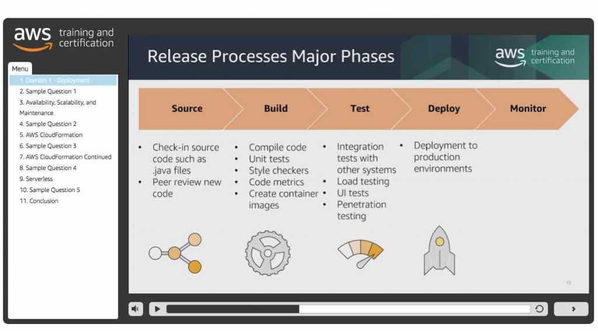

# Study Guide and Tips
The AWS Certified Developer Associate certification is for those who are interested in handling cloud-based applications and services. Typically, applications developed in AWS are sold as products in the AWS Marketplace. This allows other customers to use the customized, cloud-compatible application for their own business needs. Because of this, AWS developers should be proficient in using the AWS CLI, APIs, and SDKs for application development.

The AWS Certified Developer Associate exam (or AWS CDA for short) will test your ability to:

* Demonstrate an understanding of core AWS services, uses, and basic AWS architecture best practices.
* Demonstrate proficiency in developing, deploying, and debugging cloud-based applications using AWS.

Having prior experience in programming and scripting for both standard, containerized, and/or serverless applications will greatly make your review easier. Additionally, we recommend having an AWS account available for you to play around with to better visualize parts in your review that involve code. For more details regarding your exam, you can check out this [AWS exam blueprint](https://d1.awsstatic.com/training-and-certification/docs-dev-associate/AWS-Certified-Developer-Associate_Exam-Guide.pdf) and [official sample DVA-C02 questions](https://d1.awsstatic.com/training-and-certification/docs-dev-associate/AWS-Certified-Developer-Associate_Sample-Questions.pdf) for the AWS Certified Developer Associate exam.

## Study Materials
If you are not well-versed in the fundamentals of AWS, we suggest that you visit our [AWS Certified Cloud Practitioner](https://tutorialsdojo.com/aws-certified-cloud-practitioner/) review guide to get started. AWS also offers a free virtual course called [AWS Cloud Practitioner Essentials](https://portal.tutorialsdojo.com/product/aws-cloud-practitioner-essentials-second-edition-2021-with-clf-c01/) that you can take in their training portal. Knowing the basic concepts and services of AWS will make your review more coherent and understandable for you.

The primary study materials you’ll be using for your review are the: [FREE AWS Exam Readiness video
course](https://www.aws.training/Details/Curriculum?id=19185), [official AWS sample questions](https://d1.awsstatic.com/training-and-certification/docs-dev-associate/AWS_certified_developer_associate_examsample.pdf), AWS whitepapers, FAQs, [AWS cheat sheets](https://tutorialsdojo.com/aws-cheat-sheets/), [AWS practice
exams](https://portal.tutorialsdojo.com/courses/aws-certified-developer-associate-practice-exams/) and [AWS video course with included hands-on labs](https://portal.tutorialsdojo.com/product/aws-certified-developer-associate-video-course/).

For whitepapers, they include the following:

1. [Implementing Microservices on AWS](https://docs.aws.amazon.com/whitepapers/latest/microservices-on-aws/microservices-on-aws.pdf) – This paper introduces the ways you can implement a microservice system on different AWS Compute platforms. You should study how these systems are built and the reasoning behind the chosen services for that system.
2. [Running Containerized Microservices on AWS](https://d1.awsstatic.com/whitepapers/DevOps/running-containerized-microservices-on-aws.pdf) – This paper talks about the best practices in deploying a containerized microservice system in AWS. Focus on the example scenarios where the best practices are applied, how they are applied, and using which services to do so.
3. [Optimizing Enterprise Economics with Serverless Architectures](https://d1.awsstatic.com/whitepapers/DevOps/running-containerized-microservices-on-aws.pdf) – Read upon the use cases of serverless in different platforms. Understand when it is best to use serverless vs. maintaining your own servers. Also, familiarize yourself with the AWS services that are under the serverless toolkit.
4. [Serverless Architectures with AWS Lambda](https://d1.awsstatic.com/whitepapers/serverless-architectures-with-aws-lambda.pdf) – Learn about Serverless and Lambda as much as you can. Concepts, configurations, code, and architectures are all important and are most likely to come up in the exam. Creating a Lambda function of your own will help you remember features faster.
5. [Practicing Continuous Integration and Continuous Delivery on AWS Accelerating Software Delivery with DevOps](https://docs.aws.amazon.com/whitepapers/latest/practicing-continuous-integration-continuous-delivery/welcome.html) – If you are a developer aiming for the DevOps track, then this whitepaper is packed with practices for you to learn. CI/CD involves many stages that allow you to deploy your applications faster. Therefore, you should study the different deployment methods and understand how each of them works. Also, familiarize yourself with the implementation of CI/CD in AWS. We recommend performing a lab of this in your AWS account.
6. [Blue/Green Deployments on AWS](https://d1.awsstatic.com/whitepapers/AWS_Blue_Green_Deployments.pdf) – Blue/Green Deployments is a popular deployment method that you should learn as an AWS Developer. Study how blue/green deployments are implemented and know the set of AWS services used in application deployment. It is also crucial that you understand the scenarios where blue/green deployments are beneficial and where they are not. Do NOT mix up your blue environment from your green environment.
7. [AWS Security Best Practices](https://aws.amazon.com/architecture/security-identity-compliance) – Understand the security best practices and their purpose in your environment. Some services offer more than one form of security feature, such as multiple key management schemes for encryption. It is important that you can determine which form is most suitable for the given scenarios in your exam.
8. [AWS Well-Architected Framework](https://docs.aws.amazon.com/wellarchitected/latest/framework/wellarchitected-framework.pdf) – This whitepaper is one of the most important papers that you should study for the exam. It discusses the different pillars that make up a well-architected cloud environment. Expect the scenarios in your exam to be heavily based upon these pillars. Each pillar will have a corresponding whitepaper of its own that discusses the respective pillar in more detail.

## AWS Services to Focus On
AWS offers extensive documentation and well-written FAQs for all of its services. These two will be your primary source of information when studying AWS. You need to be well-versed in many AWS products and services since you will almost always be using them in your work. I recommend checking out [Tutorials Dojo’s AWS Cheat Sheets](https://tutorialsdojo.com/aws-cheat-sheets/), which provide a summarized but highly informative set of notes and tips for your review on these services.

Services to study for:

1. [Amazon EC2](https://tutorialsdojo.com/amazon-elastic-compute-cloud-amazon-ec2/) / [ELB](https://tutorialsdojo.com/aws-elastic-load-balancing-elb/) / [Auto Scaling](https://tutorialsdojo.com/aws-auto-scaling/) – Be comfortable with integrating EC2 to ELBs and Auto Scaling. Study the commonly used AWS CLI commands, APIs and SDK code under these services. Focus as well on security, maintaining high availability, and enabling network connectivity from your ELB to your EC2 instances. 
2. [AWS Elastic Beanstalk](https://tutorialsdojo.com/aws-elastic-beanstalk/) – Know when Elastic Beanstalk is more appropriate to use than other computing or infrastructure-as-a-code solutions like CloudFormation. Experiment with the service yourself in your AWS account, and understand how you can deploy and maintain your own application in Beanstalk.
3. [Amazon ECS](https://tutorialsdojo.com/amazon-elastic-container-service-amazon-ecs/) – Study how you can manage your own cluster using ECS. Also, figure out how ECS can be integrated into a CI/CD pipeline. Be sure to read the FAQs thoroughly since the exam includes multiple questions about containers.
4. [AWS Lambda](https://tutorialsdojo.com/aws-lambda/) – The best way to learn Lambda is to create a function yourself. Also, remember that Lambda allows custom runtimes that a customer can provide himself. Figure out what services can be integrated with Lambda and how Lambda functions can capture and manipulate incoming events. Lastly, study the Serverless Application Model (SAM).
5. [Amazon RDS](https://tutorialsdojo.com/amazon-relational-database-service-amazon-rds/) / [Amazon Aurora](https://tutorialsdojo.com/amazon-aurora/) – Understand how RDS integrates with your application through EC2, ECS, Elastic Beanstalk, and more. Compare RDS to DynamoDB and Elasticache and determine when RDS is best used. Also, know when it is better to use Amazon Aurora than Amazon RDS and when RDS is more useful than hosting your own database inside an EC2 instance.
6. [Amazon DynamoDB](https://tutorialsdojo.com/amazon-dynamodb/) – You should have a complete understanding of the DynamoDB service as this is very crucial in your exam. Read the DynamoDB documentation since it is more detailed and informative than the FAQ. As a developer, you should also know how to provision your own DynamoDB table, and you should be capable of tweaking its settings to meet application requirements.
7. [Amazon Elasticache](https://tutorialsdojo.com/amazon-elasticache/) – Elasticache is a caching service you’ll often encounter in the exam. Compare and contrast Redis from Memcached. Determine when Elasticache is more suitable
     than DynamoDB or RDS. 
8. [Amazon S3](https://tutorialsdojo.com/amazon-s3/) – S3 is usually your go-to storage for objects. Study how you can secure your objects through KMS encryption, ACLs, and bucket policies. Know how S3 stores your objects to keep them highly durable and available. Also, learn about lifecycle policies. Compare S3 to EBS and EFS to know when S3 is more preferred than the other two.
9. [Amazon EFS](https://tutorialsdojo.com/amazon-efs/) – EFS is used to set up file systems for multiple EC2 instances. Compare and contrast S3 to EFS and EBS. Study file encryption and EFS performance optimization as well.
10. [Amazon Kinesis](https://tutorialsdojo.com/amazon-kinesis/) – There are usually tricky questions on Kinesis, so you should read its documentation too. Focus on Kinesis Data Streams and explore the other Kinesis services. Familiarize yourself with Kinesis APIs, Kinesis Sharding, and integration with storage services such as S3 or compute services like AWS Lambda.
11. [Amazon API Gateway](https://tutorialsdojo.com/amazon-api-gateway/) – API gateway is usually used together with AWS Lambda as part of the serverless application model. Understand API Gateway’s structure, such as resources, stages, and methods. Learn how you can combine API Gateway with other AWS services, such as Lambda or CloudFront. Determine how you can secure your APIs so that only a select number of people can execute them.
12. [Amazon Cognito](https://tutorialsdojo.com/amazon-cognito/) – Cognito is used for mobile and web authentication. You usually encounter Cognito questions in the exam along with Lambda, API Gateway, and DynamoDB. This usually involves some mobile application requiring an easy sign-up/sign-in feature from AWS. It is highly suggested that you try using Cognito to better understand its features.
13. [Amazon SQS](https://tutorialsdojo.com/amazon-sqs/) – Study the purpose of different SQS queues, timeouts, and how your messages are handled inside queues. Messages in an SQS queue are not deleted when polled, so be sure to read on that as well. There are different polling mechanisms in SQS, so you should compare and contrast each.
14. [Amazon CloudWatch](https://tutorialsdojo.com/amazon-cloudwatch/) – CloudWatch is a primary monitoring tool for all your AWS services. Verify that you know what metrics can be found under CloudWatch monitoring and what metrics require a CloudWatch agent installed. Also, study CloudWatch Logs, CloudWatch Alarms, and Billing monitoring. Differentiate the kinds of logs stored in CloudWatch vs. logs stored in CloudTrail.
15. [AWS IAM](https://tutorialsdojo.com/aws-identity-and-access-management-iam/) – IAM is the security center of your cloud. Therefore, you should familiarize yourself with the different IAM features. Study how IAM policies are written and what each section in the policy means. Understand the usage of IAM user roles and service roles. You should have read up on the best practices whitepaper in securing your AWS account through IAM.
16. [AWS KMS](https://tutorialsdojo.com/aws-key-management-service-aws-kms/) – KMS contains keys that you use to encrypt EBS, S3, and other services. Know what these services are. Learn the different types of KMS keys and in which situations each type of key is used.
17. [AWS CodeBuild](https://tutorialsdojo.com/aws-codebuild/) / [AWS CodeCommit](https://tutorialsdojo.com/aws-codecommit/) / [AWS CodeDeploy](https://tutorialsdojo.com/aws-codedeploy/) / [AWS CodePipeline](https://tutorialsdojo.com/aws-codepipeline/) – These are your tools for implementing CI/CD in AWS. Study how you can build applications in CodeBuild (`buildspec`), and how you’ll prepare configuration files (`appspec`) for CodeDeploy. CodeCommit is a git repository, so having knowledge in Git will be beneficial. I suggest that you build a simple pipeline of your own in CodePipeline to see how you should manage your code deployments. It is also important to learn how you can roll back to your previous application version after a failed deployment. The whitepapers above should have explained in-place deployments and blue/green deployments and how to perform automation
18. [AWS CloudFormation](https://tutorialsdojo.com/aws-cloudformation/) – Study the structure of CloudFormation scripts and how you can use them to build your infrastructure. Be comfortable with both JSON and YAML formats. Read a bit about StackSets. List down the services that use CloudFormation in the backend for     provisioning AWS resources, such as AWS SAM, and processes, such as in CI/CD.

Aside from the concepts and services, you should study the [AWS CLI](https://aws.amazon.com/cli/), the different commonly used APIs (for services such as EC2, EBS, or Lambda), and the [AWS SDKs](https://aws.amazon.com/tools/). Read up on the [AWS Serverless Application Model (AWS SAM)](https://tutorialsdojo.com/aws-serverless-application-model-sam/) and [AWS Application Migration Service](https://aws.amazon.com/server-migration-service/), as well as these that may come up in the exam. It will also be very helpful to have experience interacting with AWS APIs and SDKs and troubleshooting any errors that you encounter while using them.

## Common Exam Scenarios

### Lambda

| Scenario                                                     | Solution                                                     |
| ------------------------------------------------------------ | ------------------------------------------------------------ |
| An application running in a local server is converted to a Lambda function. When the function was tested, an *Unable to import module* error showed | Install the missing modules in your application’s folder and package them into a ZIP file before uploading to  AWS Lambda. |
| A Developer is writing a Lambda function that will be used to send a request to an API in different environments (Prod, Dev, Test). The function needs to automatically invoke the correct API call based on the environment. | Use Environment Variables                                    |
| A Lambda function needs temporary storage to store files while executing. | Store the files in the `/tmp` directory                       |
| Lambda function is writing data into an RDS database. The function needs to reuse the database connection to reduce execution time. | Use execution context by placing the database connection logic outside of the event handler. |
| A Developer needs to increase the CPU available to a Lambda function to process data more efficiently. | Increase the allocated memory of the function.               |

### Amazon API Gateway

| Scenario                                                     | Solution                                                     |
| ------------------------------------------------------------ | ------------------------------------------------------------ |
| A Developer has an application that uses a RESTful API  hosted in API Gateway. The API requests are failing with a "No 'Access-Control-Allow-Origin' header is present on the requested resource" error message. | Enable CORS in the API Gateway Console.                      |
| A website integrated with API Gateway requires user requests to reach the backend server **without intervention** from the API Gateway. Which integration type should be used? | `HTTP_PROXY`                                                 |
| A serverless application is composed of AWS Lambda, DynamoDB, and API Gateway. Users are complaining about getting HTTP 504 errors. | The API requests are reaching the maximum integration timeout for API Gateway (29 seconds). |
| How to invalidate API Gateway cache?                         | 1. Send a request with a `Cache-Control: max-age` header.  2.  Enable the `Require Authorization` option on your API cache settings. |
| A developer needs to deploy different API versions in API Gateway | Use stage variables                                          |

### Amazon DynamoDB

| Scenario                                                     | Solution                                                     |
| ------------------------------------------------------------ | ------------------------------------------------------------ |
| A Developer needs a cost-effective solution to delete session data in a DynamoDB table. | Expire session data with DynamoDB TTL                        |
| New changes to a DynamoDB table should be recorded in another DynamoDB table. | Use DynamoDB Streams                                         |
| Reduce the DynamoDB database response time.                  | Use DynamoDB Accelerator (DAX)                               |
| Choosing the best partition key for the DynamDB table.       | Use the partition key with the highest cardinality (e.g. student ID, employee ID) |
| An application uses a DynamoDB database with Global Secondary Index. DynamoDB requests are returning a `ProvisionedThroughputExceededException` error. Why is this happening? | The write capacity of the GSI is less than the base table.   |

### CloudFormation and AWS SAM

| Scenario                                                     | Solution                                                     |
| ------------------------------------------------------------ | ------------------------------------------------------------ |
| What section must be added to a CloudFormation template to include resources defined by AWS SAM? | Transform                                                    |
| A developer needs a reliable framework for building serverless applications in AWS | AWS SAM                                                      |
| A CloudFormation stack creation process failed unexpectedly. | CloudFormation will roll back by deleting resources that it has already created. |
| A CloudFormation template will be used across multiple AWS accounts | Use CloudFormation StackSets                                 |

### Deployment and Security

| Scenario                                                     | Solution                                                     |
| ------------------------------------------------------------ | ------------------------------------------------------------ |
| It is required that incoming traffic is shifted in two increments. 10% of the traffic must be shifted in the first increment, and the remaining 90% should be deployed after some minutes. | Transform                                                    |
| You need to authenticate users of a website using social media identity profiles. | Amazon Cognito Identity Pools                                |
| A company has two accounts. The developers from Account A need to access resources on Account B | Use cross-account access role                                |
| Multiple developers need to make incremental code updates to a single project and then deploy the new changes. | Use AWS CodeCommit as the code repository and directly deploy the new package using AWS CodeDeploy. |
| A development team is using CodePipeline to automate their deployment process. The code changes must be reviewed by a person before releasing to production | Add a manual approval action stage                           |

### Relevant API/CLI commands

| Scenario                                                     | Solution                                                     |
| ------------------------------------------------------------ | ------------------------------------------------------------ |
| A Developer needs to decode an encoded authorization failure message. | Use the `aws sts decode-authorization-message` command.      |
| How can a Developer verify permission to call a CLI command without actually making a request? | Use the `--dry-run` parameter along with the CLI command.    |
| A Developer needs to deploy a CloudFormation template from a local computer. | Use the `aws cloudformation package` and `aws cloudformation deploy` command |
| A Developer has to ensure that no applications can fetch a message from an SQS queue that’s being processed or has already been processed. | Increase the `VisibilityTimeout` value using the `ChangeMessageVisibility` API and delete the message using the `DeleteMessage` API. |
| A Developer has created an IAM Role for an application that uploads files to an S3 bucket. Which API call should the Developer use to allow the application to make upload requests? | Use the `AssumeRole` API                                     |

